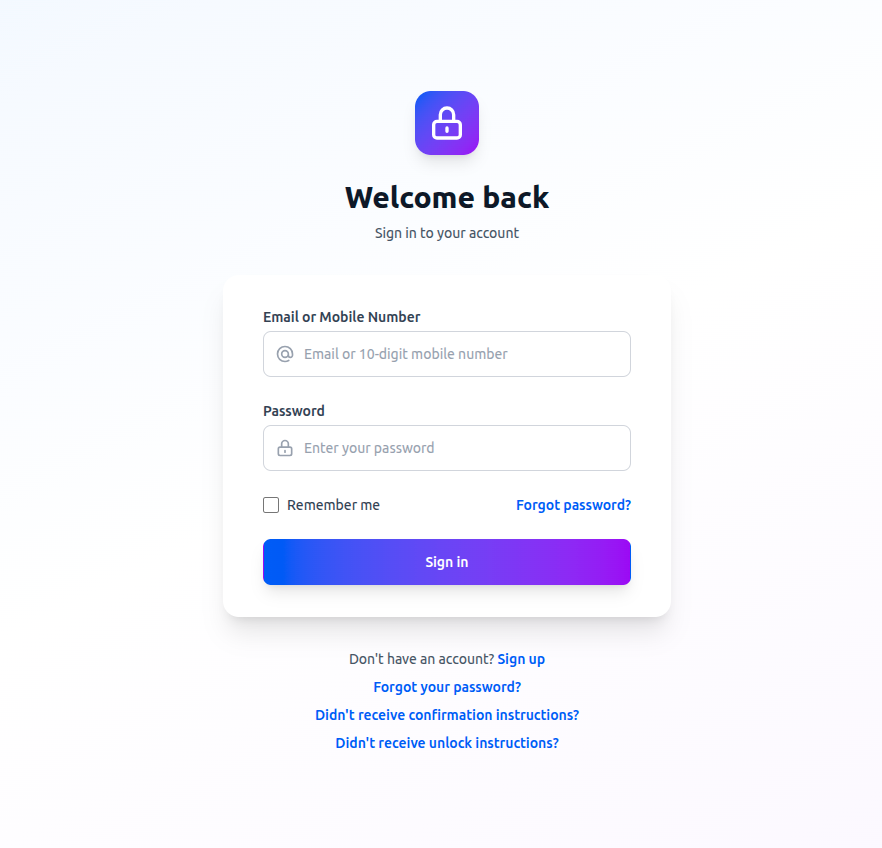
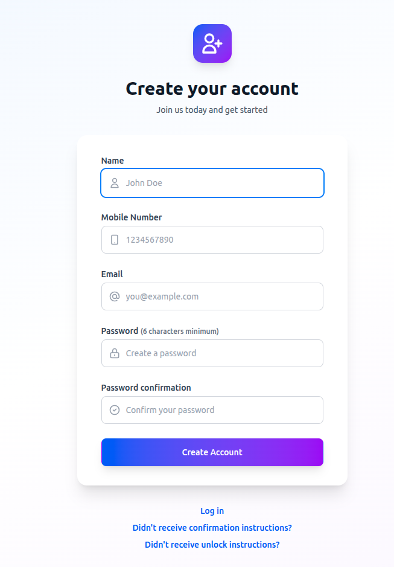
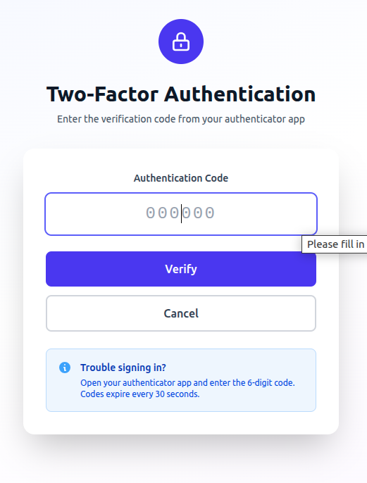
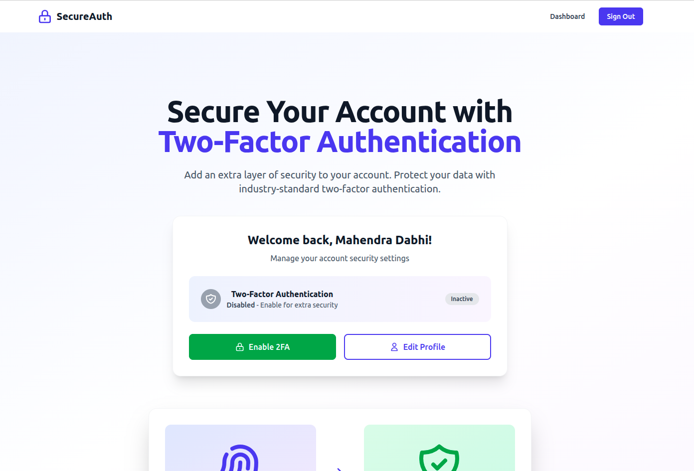
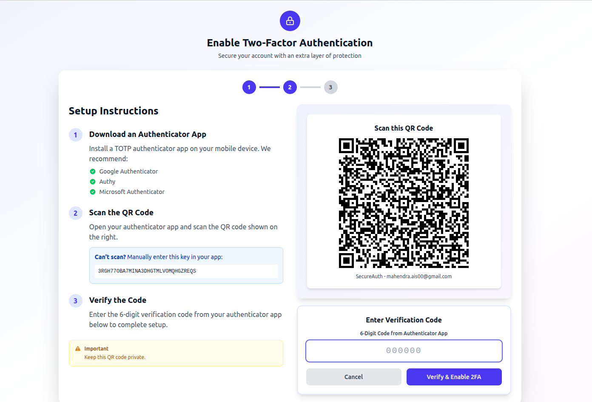
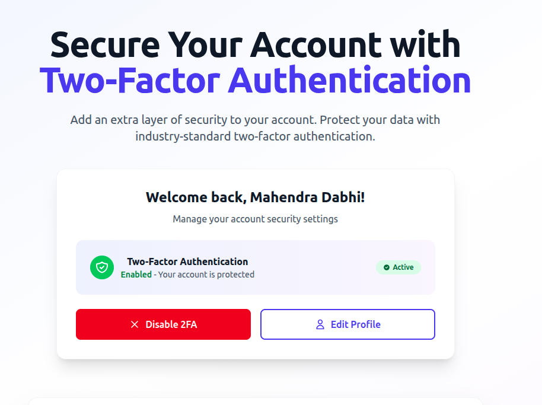

# SecureAuth - Two-Factor Authentication Application

A modern Ruby on Rails application featuring two-factor authentication (2FA) with flexible login options using either email or mobile number.
## Screenshot






## Features

- **Flexible Authentication**: User authentication with Devise
- **Multi-Login Options**: Login with Email or Mobile Number (10-digit)
- **Two-Factor Authentication (2FA)**:
  - TOTP-based authentication using authenticator apps (Google Authenticator, Authy, Microsoft Authenticator)
  - QR code setup for easy configuration
  - Backup codes for account recovery
  - Manual key entry option
  - Secure OTP verification during login
- **Modern UI**: Responsive design with Tailwind CSS
- **Account Security**:
  - Email confirmation required
  - Password recovery
  - Account lockout after failed attempts
  - Session tracking (IP address, sign-in count, timestamps)
  - Encrypted OTP secret storage

## Technology Stack

- **Ruby version**: 3.x
- **Rails version**: 7.1.6
- **Database**: MySQL
- **CSS Framework**: Tailwind CSS
- **Authentication**: Devise
- **Frontend**: Turbo, Stimulus

## System Dependencies

- Ruby 3.x
- Rails 7.1.6
- MySQL 8.0+
- Node.js and Yarn (for asset compilation)

## Installation

1. Clone the repository:
```bash
git clone <repository-url>
cd two_factor_auth
```

2. Install dependencies:
```bash
bundle install
yarn install
```

3. Configure database:
Update `config/database.yml` with your MySQL credentials.

4. Setup encryption credentials:
```bash
# Generate encryption keys for Active Record and 2FA
rails db:encryption:init

# This will output keys that need to be added to credentials
# Add them using the credentials editor:
EDITOR="nano" rails credentials:edit

# Add the following to your credentials file:
# active_record_encryption:
#   primary_key: <generated_key>
#   deterministic_key: <generated_key>
#   key_derivation_salt: <generated_key>
# otp_secret_encryption_key: <generate using: rails secret>
```

5. Create and setup database:
```bash
rails db:create
rails db:migrate
rails db:seed
```

6. Start the development server:
```bash
bin/dev
```

The application will be available at `http://localhost:3000`

## Configuration

### Devise Setup

The application uses Devise for authentication with custom configuration:

- **Authentication Keys**: Users can login with either email or mobile number
- **Confirmable**: Email confirmation required for new accounts
- **Lockable**: Account locks after failed login attempts
- **Trackable**: Tracks sign-in count, timestamps, and IP addresses
- **Recoverable**: Password reset functionality

### Email Configuration

Update `config/environments/development.rb` and `config/environments/production.rb` with your email provider settings:

```ruby
config.action_mailer.smtp_settings = {
  address: 'smtp.gmail.com',
  port: 587,
  domain: 'example.com',
  user_name: ENV['SMTP_USERNAME'],
  password: ENV['SMTP_PASSWORD'],
  authentication: 'plain',
  enable_starttls_auto: true
}
```

## Usage

### User Registration

Users can register with:
- Name
- Email address
- Mobile number (10-digit format)
- Password

### Login Options

Users can sign in using either:
- **Email**: user@example.com
- **Mobile Number**: 9944884488

The system automatically detects which credential type is being used.

### Two-Factor Authentication

#### Enabling 2FA

1. **Login to your account**
2. **Navigate to the homepage** where you'll see the 2FA settings card
3. **Click "Enable 2FA"** button
4. **Scan the QR code** with your authenticator app:
   - Google Authenticator
   - Authy
   - Microsoft Authenticator
   - Any TOTP-compatible app
5. **Enter the 6-digit code** from your app to verify
6. **Save your backup codes** - These are displayed after successful setup and can be used if you lose access to your authenticator app

#### Using 2FA During Login

When 2FA is enabled, the login process works as follows:

1. **Enter your email/mobile and password** on the login page
2. **If credentials are valid**, you'll be redirected to the 2FA verification page
3. **Enter the 6-digit code** from your authenticator app
4. **Submit** to complete login

**Important Security Note**: You cannot bypass the OTP verification by visiting other pages. The system ensures you remain unauthenticated until OTP is successfully verified.

#### Disabling 2FA

1. **Login to your account** (with OTP verification if enabled)
2. **Navigate to the homepage**
3. **Click "Disable 2FA"** button
4. **Enter your password** to confirm
5. **Submit** to disable 2FA

#### Backup Codes

- Backup codes are generated when you enable 2FA
- Each code can only be used once
- Store them in a secure location
- Use them if you lose access to your authenticator app
- You can use a backup code in place of the OTP code during login

## Database Schema

### Users Table

#### Authentication & Identity
- `email` - User's email address (unique, indexed)
- `mobile_no` - User's mobile number (unique, 10 digits, indexed)
- `name` - User's full name
- `encrypted_password` - Bcrypt encrypted password

#### Password Recovery
- `reset_password_token` - Token for password reset (unique, indexed)
- `reset_password_sent_at` - Timestamp when reset was requested

#### Email Confirmation
- `confirmation_token` - Token for email confirmation (unique, indexed)
- `confirmed_at` - Timestamp when email was confirmed
- `confirmation_sent_at` - Timestamp when confirmation email was sent
- `unconfirmed_email` - New email waiting for confirmation

#### Account Security
- `failed_attempts` - Number of failed login attempts
- `unlock_token` - Token for account unlock (unique, indexed)
- `locked_at` - Timestamp when account was locked

#### Session Tracking
- `sign_in_count` - Total number of sign-ins
- `current_sign_in_at` - Current sign-in timestamp
- `last_sign_in_at` - Previous sign-in timestamp
- `current_sign_in_ip` - Current sign-in IP address
- `last_sign_in_ip` - Previous sign-in IP address

#### Two-Factor Authentication
- `encrypted_otp_secret` - Encrypted TOTP secret key
- `encrypted_otp_secret_iv` - Initialization vector for encryption
- `encrypted_otp_secret_salt` - Salt for encryption
- `consumed_timestep` - Last used OTP timestep (prevents replay attacks)
- `otp_required_for_login` - Boolean flag indicating if 2FA is enabled
- `otp_backup_codes` - JSON array of backup codes

## Development

### Running Tests

```bash
rails test
```

### Code Style

The application follows standard Ruby and Rails conventions.

### Asset Compilation

Assets are automatically compiled when running `bin/dev`. To manually compile:

```bash
rails assets:precompile
```

## Deployment

1. Set environment variables:
   - `SECRET_KEY_BASE`
   - `DATABASE_URL`
   - `SMTP_USERNAME`
   - `SMTP_PASSWORD`

2. Precompile assets:
```bash
RAILS_ENV=production rails assets:precompile
```

3. Run migrations:
```bash
RAILS_ENV=production rails db:migrate
```

4. Start the server:
```bash
RAILS_ENV=production rails server
```

## Security Features

### Authentication Security
- **Password Encryption**: bcrypt hashing with salt
- **CSRF Protection**: Enabled by default in Rails
- **SQL Injection Prevention**: Parameterized queries via ActiveRecord
- **XSS Protection**: Automatic HTML escaping in ERB templates
- **Session Management**: Secure, encrypted session cookies

### Account Protection
- **Account Lockout**: Automatic lockout after multiple failed login attempts
- **Email Confirmation**: Required for account activation
- **Secure Password Reset**: Time-limited tokens for password recovery
- **IP Tracking**: Monitor sign-in locations

### Two-Factor Authentication Security
- **TOTP Algorithm**: Time-based One-Time Password (RFC 6238)
- **Encrypted Storage**: OTP secrets encrypted using AES-256
- **Replay Attack Prevention**: Consumed timestep tracking
- **Backup Codes**: One-time use codes for emergency access
- **Session-Based OTP Flow**: User not authenticated until OTP verified
- **No Bypass Protection**: Cannot access protected pages without OTP verification

## Technical Implementation

### 2FA Architecture

The application implements a secure 2FA flow using a concern-based architecture:

#### Components

1. **AuthenticateWithOtpTwoFactor Concern** (`app/controllers/concerns/authenticate_with_otp_two_factor.rb`)
   - Handles the entire 2FA authentication flow
   - Intercepts login attempts via `prepend_before_action`
   - Validates OTP codes and backup codes
   - Manages session state during authentication

2. **Custom Sessions Controller** (`app/controllers/users/sessions_controller.rb`)
   - Extends Devise's SessionsController
   - Includes the AuthenticateWithOtpTwoFactor concern
   - Uses `prepend_before_action` to check for 2FA before standard authentication

3. **User Model** (`app/models/user.rb`)
   - Implements devise-two-factor gem integration
   - Encrypts OTP secrets using attr_encrypted
   - Provides methods for:
     - `enable_two_factor!` - Enable 2FA for user
     - `disable_two_factor!` - Disable 2FA for user
     - `generate_otp_backup_codes!` - Generate backup codes
     - `validate_and_consume_otp!` - Verify OTP code
     - `invalidate_otp_backup_code!` - Consume backup code

#### Security Flow

```
Login Request → Password Validation → 2FA Check
                                         ↓
                                    2FA Enabled?
                                    ↙         ↘
                                  Yes          No
                                   ↓            ↓
                         Store user_id    Sign in user
                         in session       immediately
                              ↓
                         Render OTP form
                         (NOT signed in)
                              ↓
                         User enters OTP
                              ↓
                         Validate OTP
                         ↙         ↘
                      Valid      Invalid
                        ↓            ↓
                   Sign in      Show error
                   Clear         Re-render
                   session       OTP form
```

### Gems Used

- **devise** (4.9.x) - Authentication framework
- **devise-two-factor** (~> 6.1.0) - 2FA extension for Devise
- **attr_encrypted** (~> 4.0.0) - Encryption for OTP secrets
- **rqrcode** - QR code generation for authenticator app setup
- **tailwindcss-rails** - CSS framework
- **turbo-rails** - SPA-like page acceleration (disabled for auth forms)

## Contributing

1. Fork the repository
2. Create your feature branch (`git checkout -b feature/amazing-feature`)
3. Commit your changes (`git commit -m 'Add some amazing feature'`)
4. Push to the branch (`git push origin feature/amazing-feature`)
5. Open a Pull Request

## License

This project is available as open source under the terms of the MIT License.

## Support

For issues, questions, or contributions, please open an issue in the repository.
